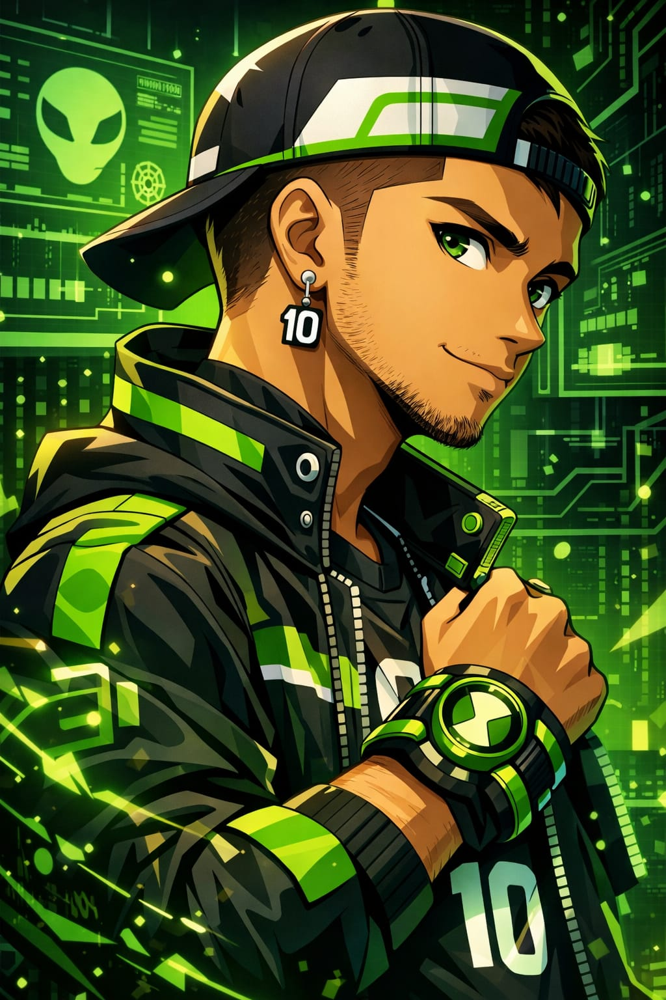
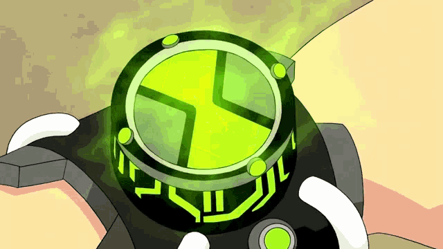
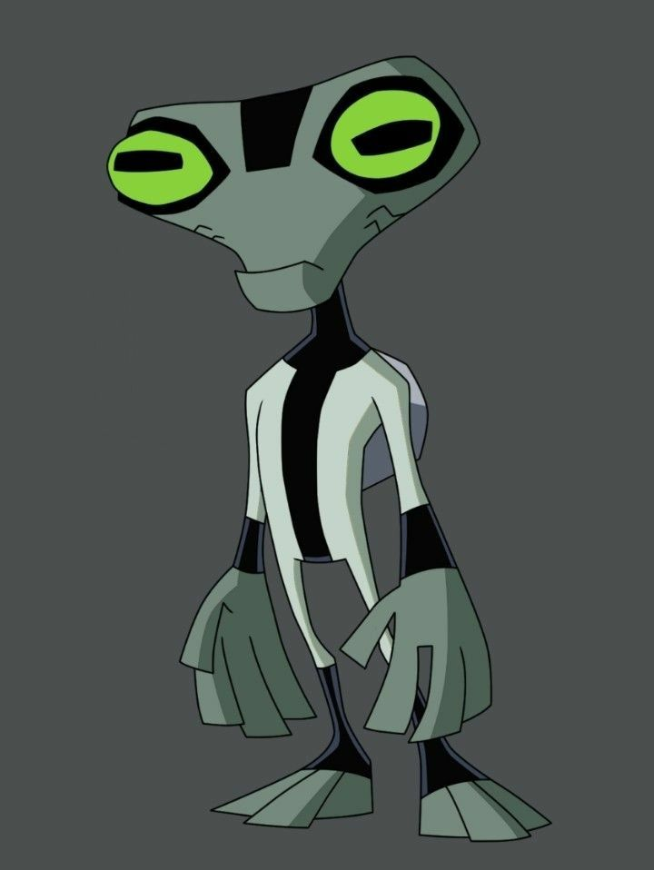
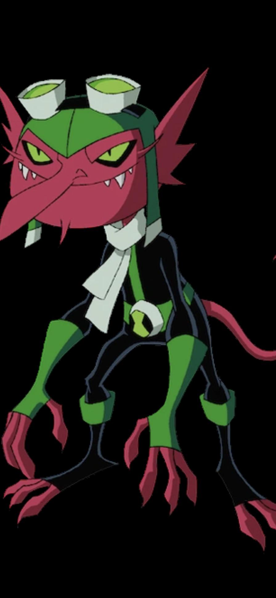
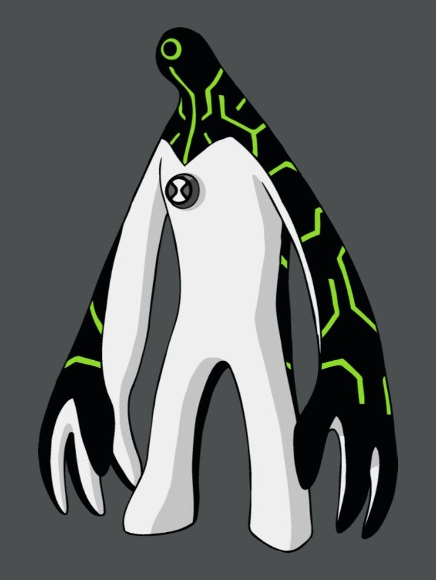
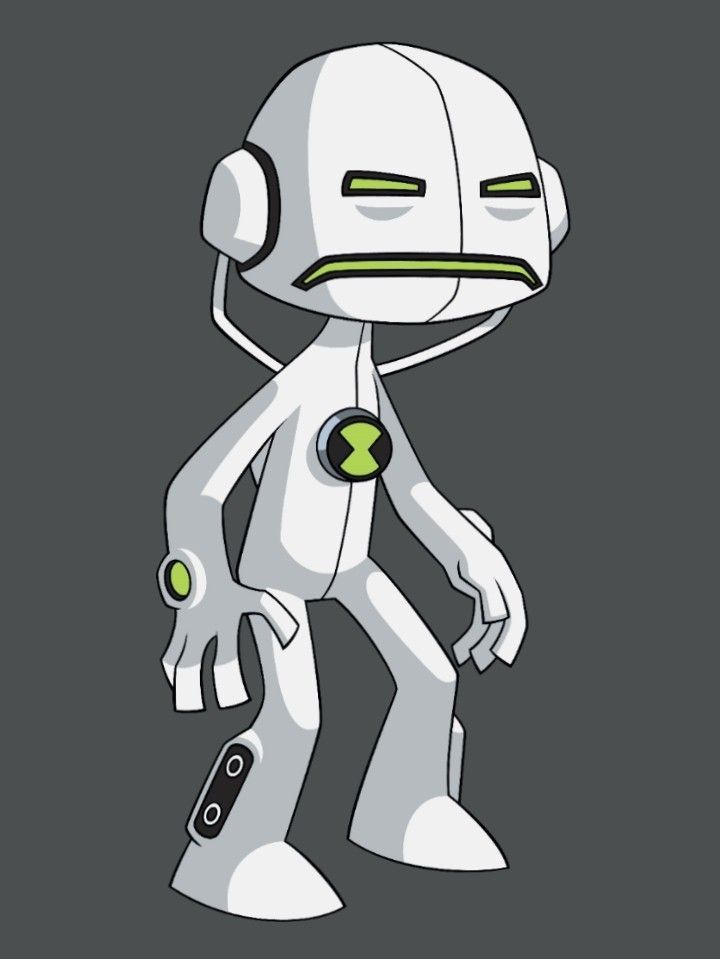

<table>
<tr>
<td>
Sabe aquela pessoa que quer saber um pouquinho de tudo? Pois é, esse sou eu. Curioso por natureza, não tem jeito.
 
Eu amo botar a mão na massa e aprender tudo o que é necessário pra fazer as coisas darem certo. Então, se você estiver procurando por um programador que não tem medo de aprender a pilotar um avião em pleno voo, está no lugar certo.
 
Gosto de pensar que cada problema é como um vilão que preciso derrotar, e para isso, eu escolho o alien certo pra missão.
 
Sinta-se livre pra explorar meus projetos, e se precisar, trocar uma ideia ou trabalhar junto, só dar um toque.
  
<strong>Tá na hora do herói!</strong>
</td>
<td>

</td>
</tr>
</table>

#
 

English version translated with AI support

#
 

#
 

 

<table>
<tr>
<td>
 
</td>
<td>
<b>Controle Mestre do Omnitrix</b>  
<i>Qual é, algo bom!</i>
</td>
</tr>
<tr>
<td align="center">
 
<b>Massa Cinzenta</b> 
</td>
<td>
<b>Programação</b>  

</td>
</tr>
<tr>
<td align="center">
 
<b>Diabrete</b> 
</td>
<td>
<b>Sistemas</b>  

</td>
</tr>
<tr>
<td align="center">
 
<b>Ultra T</b> 
</td>
<td>
<b>Ferramentas de Desenvolvimento</b>  

</td>
</tr>
<tr>
<td align="center">
 
<b>Eco Eco</b> 
</td>
<td>
<b>Ferramentas de Criação</b>  

</td>
</tr>
<tr>
<td align="center">
 
</td>
<td>
<i>Hora de Codar!</i>
</td>
</tr>
</table>

  

